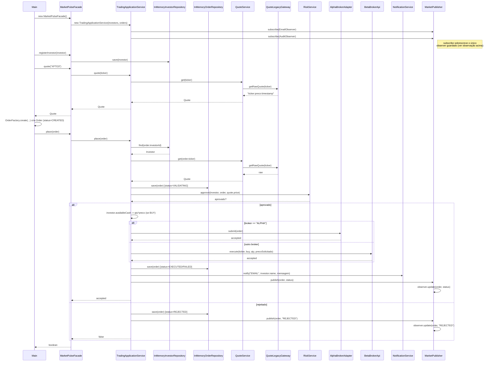

# Diagramas do MarketPulse

Baseados no código-fonte completo em `src/main/java/br/edu/marketpulse` (pacotes `model`, `repository`, `service`, `patterns.*` e `legacy`).

## 1. Diagrama de classes

Representa as classes reais do código, agrupadas por pacote, com atributos, métodos principais e relações (composição, dependência, herança, realização).

```mermaid
classDiagram
  namespace model {
    class Investor {
      +String id
      +String name
      +String riskProfile
      +double availableCash
    }
    class Order {
      +String id
      +String investorId
      +String ticker
      +String side
      +String type
      +int quantity
      +double requestedPrice
      +String broker
      +String status
    }
    class Quote {
      +String ticker
      +double price
      +long timestamp
    }
  }

  namespace repository {
    class InMemoryInvestorRepository {
      -Map~String,Investor~ data
      +save(Investor)
      +find(String) Investor
      +all() Collection~Investor~
    }
    class InMemoryOrderRepository {
      -Map~String,Order~ data
      +save(Order)
      +find(String) Order
      +all() Collection~Order~
    }
  }

  namespace service {
    class TradingApplicationService {
      +InMemoryInvestorRepository investors
      +InMemoryOrderRepository orders
      -QuoteService quotes
      -RiskService risk
      -NotificationService notifications
      -MarketPublisher publisher
      +place(Order) boolean
      +quote(String) Quote
      +publisher() MarketPublisher
    }
    class QuoteService {
      -QuoteLegacyGateway gateway
      +get(String) Quote
    }
    class RiskService {
      +approve(Investor, Order, double) boolean
    }
    class NotificationService {
      +notify(String canal, String destino, String msg)
    }
  }

  namespace patterns_facade {
    class MarketPulseFacade {
      -InMemoryInvestorRepository investors
      -InMemoryOrderRepository orders
      -TradingApplicationService trading
      +registerInvestor(Investor)
      +place(Order) boolean
      +quote(String) Quote
      +getTradingService() TradingApplicationService
      +getOrderRepository() InMemoryOrderRepository
    }
  }

  namespace patterns_factory {
    class OrderFactory {
      +create(type, id, investor, ticker, side, qty, price, broker)$ Order
    }
  }

  namespace patterns_adapter {
    class AlphaBrokerAdapter {
      +submit(Order) boolean
      +rawLegacyCall(...) String
    }
  }

  namespace patterns_observer {
    class MarketObserver {
      <<interface>>
      +update(Order, String)
    }
    class MarketPublisher {
      -MarketObserver observer
      +subscribe(MarketObserver)
      +publish(Order, String)
    }
    class EmailObserver
    class AuditObserver
  }

  namespace patterns_strategy {
    class InvestmentStrategy {
      <<interface>>
      +targetPrice(double) double
    }
    class InvestmentDecisionEngine {
      -InvestmentStrategy strategy
      +setStrategy(InvestmentStrategy)
      +calculateTarget(String perfil, double preco) double
    }
  }

  namespace patterns_abstractfactory {
    class TradingFamilyFactory {
      +createBroker(String) Object
      +createNotifier(String) Object
      +createQuoteSource(String) Object
    }
  }

  namespace legacy {
    class AlphaBrokerLegacyClient {
      +sendLegacy(...) String
    }
    class BetaBrokerApi {
      +execute(...) boolean
    }
    class QuoteLegacyGateway {
      +getRawQuote(String) String
    }
    class WhatsappLegacyApi {
      +push(String, String)
    }
  }

  class Main {
    +main(String[])$
  }

  Main ..> MarketPulseFacade : usa
  Main ..> OrderFactory : usa

  MarketPulseFacade *-- InMemoryInvestorRepository
  MarketPulseFacade *-- InMemoryOrderRepository
  MarketPulseFacade *-- TradingApplicationService

  TradingApplicationService --> InMemoryInvestorRepository
  TradingApplicationService --> InMemoryOrderRepository
  TradingApplicationService *-- QuoteService
  TradingApplicationService *-- RiskService
  TradingApplicationService *-- NotificationService
  TradingApplicationService *-- MarketPublisher
  TradingApplicationService ..> AlphaBrokerAdapter : cria se broker=ALPHA
  TradingApplicationService ..> BetaBrokerApi : cria se broker!=ALPHA

  QuoteService *-- QuoteLegacyGateway
  NotificationService ..> WhatsappLegacyApi : cria se canal=WHATSAPP

  AlphaBrokerAdapter --|> AlphaBrokerLegacyClient
  OrderFactory ..> Order : cria

  MarketPublisher --> MarketObserver : notifica
  EmailObserver ..|> MarketObserver
  AuditObserver ..|> MarketObserver

  InvestmentDecisionEngine --> InvestmentStrategy

  TradingFamilyFactory ..> AlphaBrokerLegacyClient : cria
  TradingFamilyFactory ..> BetaBrokerApi : cria
  TradingFamilyFactory ..> WhatsappLegacyApi : cria
  TradingFamilyFactory ..> QuoteLegacyGateway : cria

  InMemoryInvestorRepository --> Investor
  InMemoryOrderRepository --> Order
  RiskService ..> Investor
  RiskService ..> Order
```



**Observações relevantes para o ADR:**
- `TradingFamilyFactory` (Abstract Factory) e `InvestmentDecisionEngine`/`InvestmentStrategy` (Strategy) existem no código mas **não são chamados** pelo fluxo principal (`Main` → `Facade` → `TradingApplicationService`) — são candidatos a refatoração ou código ainda não integrado.
- `MarketPublisher` guarda apenas **um único `MarketObserver`** (campo simples, não uma lista). Como `TradingApplicationService` chama `subscribe` duas vezes (`EmailObserver` depois `AuditObserver`), o segundo sobrescreve o primeiro — só o `AuditObserver` recebe notificações em tempo de execução, mesmo o Observer sendo pensado para múltiplos assinantes.

## 2. Diagrama de sequência

Fluxo completo executado por `Main`: montagem das dependências, cadastro do investidor, consulta de cotação, criação e envio de uma ordem.



**Ponto de atenção arquitetural:** `investor.availableCash` é debitado **antes** da confirmação da corretora (adapter/API legada). Se a chamada externa falhar (`status=FAILED`), o saldo já foi descontado e não há rollback — um risco de consistência que vale registrar no ADR.

## 3. Diagrama conceitual

Modelo de domínio no nível de negócio (independe de classes/pacotes Java), mostrando os conceitos e como se relacionam.

```mermaid
classDiagram
  class Investidor {
    nome
    perfil de risco
    saldo disponível
  }
  class Ordem {
    ativo
    tipo de operação (compra/venda)
    quantidade
    preço solicitado
    status
  }
  class Cotação {
    ativo
    preço
    horário
  }
  class Corretora {
    nome
  }
  class AnáliseDeRisco {
    resultado (aprovado/rejeitado)
  }
  class Notificação {
    canal
    mensagem
  }
  class EventoDeMercado {
    tipo do evento
  }

  Investidor "1" --> "0..*" Ordem : realiza
  Ordem "1" --> "1" Cotação : é precificada por
  Ordem "1" --> "1" Corretora : é enviada para
  Ordem "1" --> "1" AnáliseDeRisco : é avaliada por
  AnáliseDeRisco --> Investidor : considera perfil e saldo
  Ordem "1" --> "0..*" Notificação : gera
  Ordem "1" --> "0..*" EventoDeMercado : dispara
  Notificação --> Investidor : informa
```

Esse diagrama descreve **o negócio** (o investidor realiza ordens, que são precificadas, avaliadas quanto ao risco, enviadas a uma corretora e geram notificações/eventos), sem amarrar a nenhum padrão de projeto ou classe Java específica — é a base conceitual que a implementação (diagrama de classes) concretiza.
